# Reporte de Avance No. 2

| | |
|---|---|
| **Fecha** | 9 de septiembre de 2026 |
| **Versión** | v1.1.0 |
| **Estado** | En desarrollo (rama `dev`) |
| **Preparado por** | Equipo de Desarrollo ABAQ |

---

!!! abstract "Descargas"
    Puedes descargar este documento en los siguientes formatos:
    
    - :lucide-file-text: **[Descargar PDF](latex/report2.pdf)**
    - :lucide-file: **[Descargar Word (.docx)](latex/report2.docx)**

## Resumen ejecutivo

Este documento presenta el segundo reporte de avance del proyecto ABAQ, la plataforma digital para la gestión del servicio social. Durante este período se realizaron mejoras significativas tanto en la seguridad del servidor como en la experiencia visual de la aplicación web.

En el lado del servidor se implementó un sistema de autenticación que protege toda la información sensible: ahora solo los usuarios con sesión iniciada pueden consultar o modificar datos de estudiantes, contactos, actividades y encuestas. La única excepción intencional es el formulario público para aspirantes, que continúa disponible sin restricción.

En la aplicación web se construyeron tres pantallas completamente nuevas: el **Panel de Administración**, la **Vista de Detalle de Estudiante** y la **Vista de Detalle de Actividad**. Además se mejoraron las listas existentes, se rediseñó la página de inicio y se integró la capacidad de subir documentos directamente desde la plataforma.

El presente reporte documenta y evidencia estos avances con capturas de pantalla del sistema en funcionamiento, cumpliendo con el compromiso de coordinación y seguimiento del progreso establecido con el cliente.

---

## 1. Introducción

Este documento resume los cambios más recientes realizados en la plataforma **ABAQ**, la herramienta de gestión de servicio social. El objetivo es comunicar, de forma clara y sin tecnicismos, qué mejoró, qué se agregó y qué quedó más seguro desde la última entrega.

Los cambios se dividen en dos áreas principales:

- **Servidor (Backend):** la parte que no se ve, encargada de guardar y proteger los datos.
- **Aplicación web (Frontend):** la parte visual con la que interactúan administradores y estudiantes.

---

## 2. Cambios en el Servidor (Backend)

### Protección de rutas con autenticación

Anteriormente, alguien con conocimientos técnicos podía acceder a la información de estudiantes, contactos, encuestas y actividades sin necesidad de haber iniciado sesión. Ahora eso ya no es posible.

Se protegieron los siguientes módulos:

- **Estudiantes:** para ver, crear, editar o eliminar un estudiante, es obligatorio haber iniciado sesión.
- **Contactos:** toda acción sobre contactos requiere autenticación.
- **Encuestas:** la consulta de encuestas ya guardadas ahora requiere sesión iniciada. La encuesta pública que llenan los aspirantes sigue disponible sin restricción.
- **Actividades y mascotas:** protegidas de la misma manera.

### Mejoras en la configuración

- Se actualizó el archivo de ejemplo de configuración (`.env.example`) para incluir las variables necesarias para el sistema de autenticación JWT.
- Se actualizó el `README` con instrucciones más claras sobre cómo instalar y configurar el servidor.
- Se excluyó un archivo de registro local (`log.txt`) del control de versiones.

### Resumen de cambios — Backend

| Área | Descripción del cambio |
|---|---|
| Seguridad | Se requiere inicio de sesión para acceder a datos de estudiantes, contactos, encuestas y actividades |
| Encuesta pública | El formulario para aspirantes continúa accesible sin sesión |
| Documentación | README actualizado con instrucciones de instalación y variables de entorno |
| Configuración | Archivo `.env.example` con variables de autenticación JWT |
| Limpieza | Archivo `log.txt` excluido del repositorio |

---

## 3. Cambios en la Aplicación Web (Frontend)

### Panel de Administración

Se creó una pantalla de inicio exclusiva para administradores. Muestra métricas generales (estudiantes, actividades, inscripciones, asignaciones pendientes), una agenda con próximas actividades y un panel de seguimiento con elementos que requieren atención.

### Vista de Detalle de Estudiante

Nueva pantalla con el expediente completo del estudiante: datos personales, horas requeridas, horas acreditadas, edición de información, carga de documentos oficiales (carta de aceptación, constancia de plática, carta de término) y listado de actividades.

### Lista de Estudiantes

Tabla mejorada con buscador por nombre, carrera, correo o teléfono, y acceso directo al detalle de cada estudiante.

### Lista de Actividades

Tarjetas mejoradas con buscador por título, descripción, tipo, horas o ID. Cada actividad muestra tipo, duración, horario y enlace.

### Panel del Estudiante

Rediseño de la pantalla de inicio para estudiantes: saludo personalizado, carrera, semestre, horas requeridas, horas acreditadas, actividades pendientes, historial y gráficas de progreso.

### Carga de Archivos

Nuevo servicio para subir documentos PDF directamente desde la plataforma sin salir de la aplicación.

### Resumen de cambios — Frontend

| Área | Descripción del cambio |
|---|---|
| Panel de administración | Nueva pantalla con métricas, agenda y panel de seguimiento |
| Detalle de estudiante | Nueva pantalla con expediente, edición y carga de documentos |
| Lista de estudiantes | Tabla mejorada con buscador y acceso a detalle |
| Lista de actividades | Tarjetas mejoradas con buscador por múltiples criterios |
| Panel del estudiante | Rediseño con datos personales, progreso e historial |
| Carga de archivos | Nuevo servicio para subir documentos PDF |
| Navegación | Nuevas rutas para las pantallas de detalle |

---

## 4. Evidencia Visual

### Panel de administración

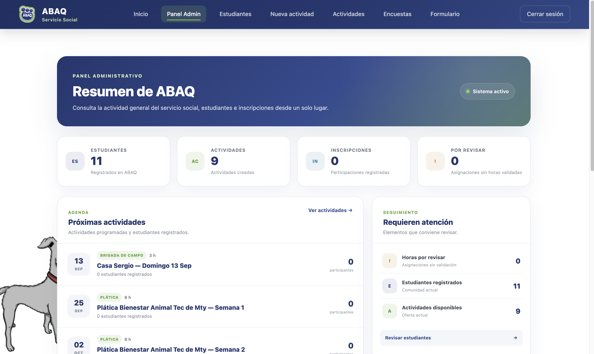

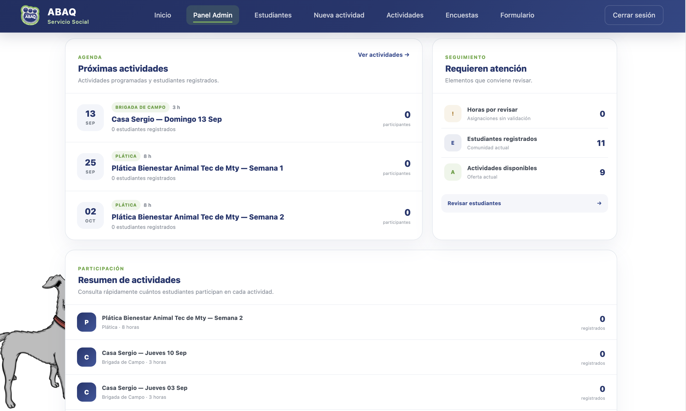

### Gestión de estudiantes

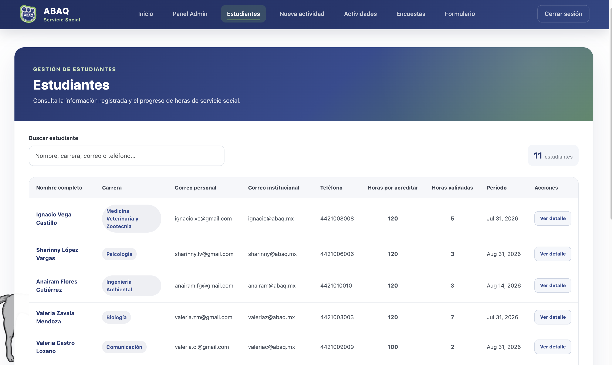

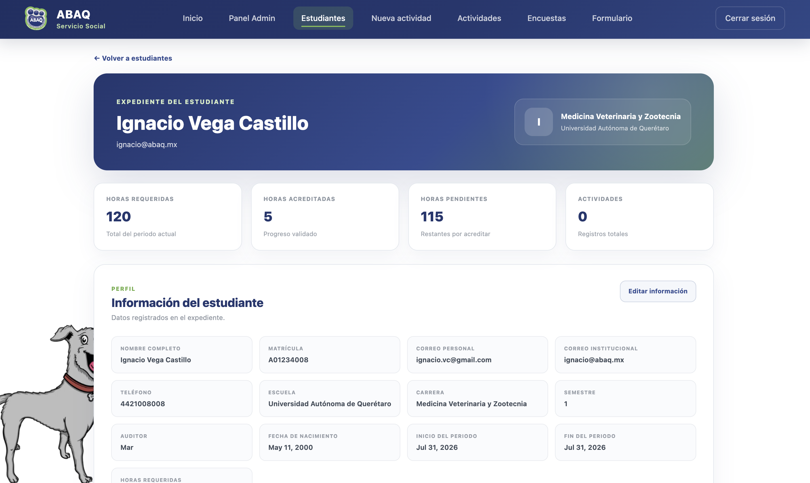

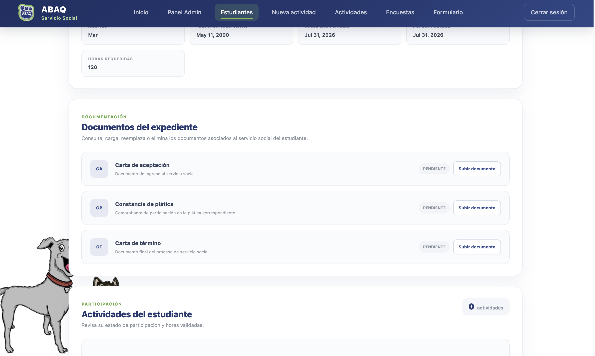

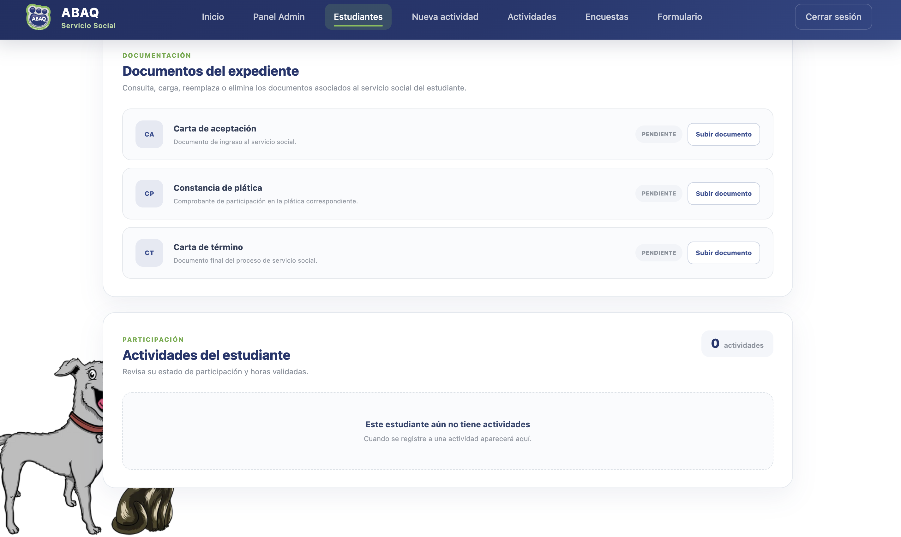

### Actividades disponibles

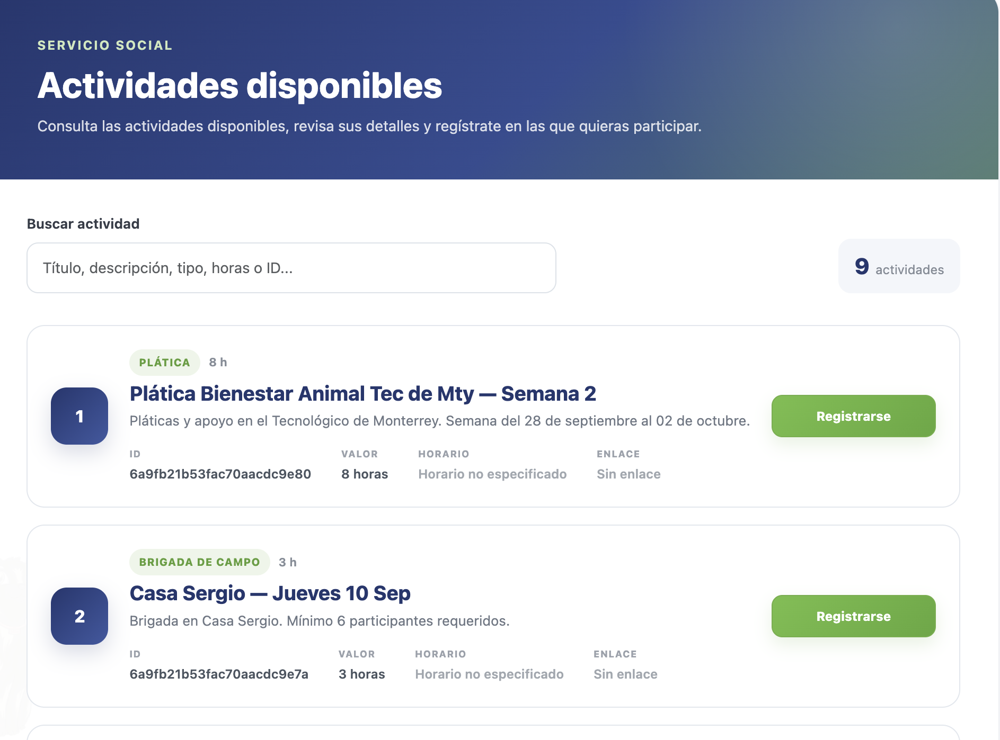

### Panel del estudiante

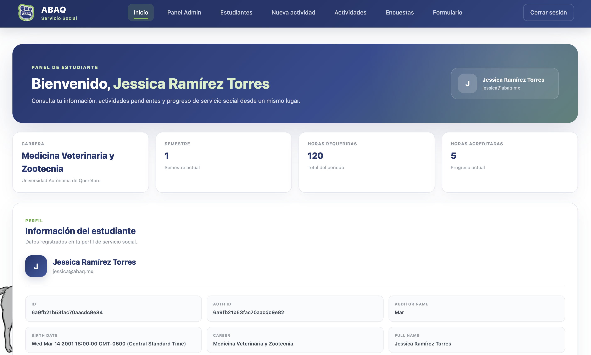

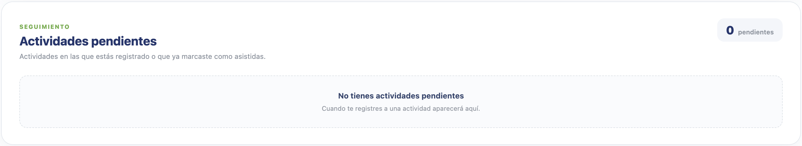

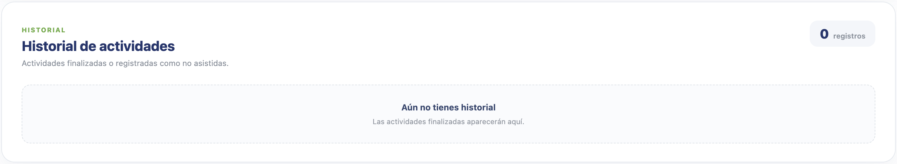

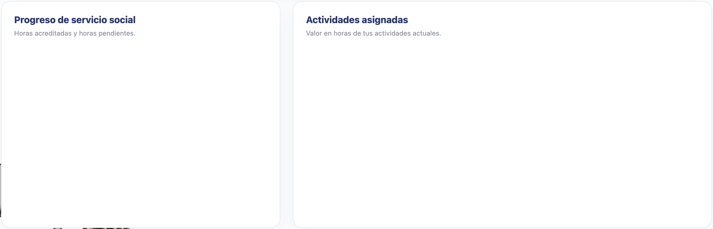

---

## 5. Estado Actual del Proyecto

!!! info "Sigue en discusión"
    El estado detallado de los módulos se definirá en la siguiente reunión de seguimiento.

---

## 6. Próximos Pasos

Los cambios descritos en este reporte han sido revisados, documentados y evidenciados con capturas de pantalla del sistema en funcionamiento. El compromiso de coordinación y seguimiento del progreso queda cubierto con la entrega de este documento.

**No existen pendientes adicionales para esta etapa.**
